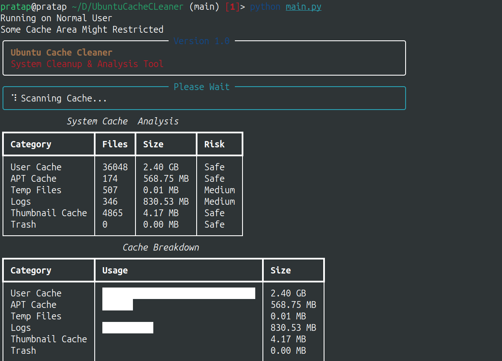
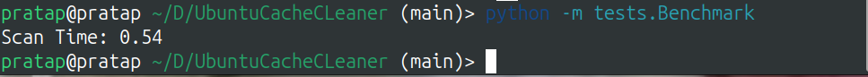

# Ubuntu Cache Cleaner

Ubuntu Cache Cleaner is a terminal-based utility designed to help Ubuntu users understand, analyze, and safely clean cache and temporary system data.

It is built with a strong focus on clarity and usability for beginners, while still providing a structured and reliable workflow suitable for production-level use.

## Why This Project Exists

Many new Ubuntu users even I when i was new to Ubuntu face storage issues caused by accumulated package cache (`apt`, `.deb`, and related temporary files).  
Although commands such as `apt clean` are available, they do not always provide:

- clear visibility into what is consuming space
- confidence about what is safe to remove
- an interactive experience that helps users learn the system

This project addresses that gap with an interactive terminal experience, including visual feedback and guided cleaning actions.

## Project Goals

The goal is to build a production-ready Ubuntu terminal application that:

- scans cache and temporary files intelligently
- visualizes disk and cache usage in the terminal
- performs safe cleanup operations
- provides real-time status and feedback
- remains beginner-friendly and reliable

## Technology Stack

| Area | Tools |
| --- | --- |
| Core Language | Python 3.12+ |
| Terminal UI | Rich |
| Charts | Plotext |
| System Access | `psutil`, `os`, `pathlib`, `shutil`, `subprocess` |
| Packaging | PyInstaller, pip packaging |
| Testing | pytest |

## 📊 Architecture

```
                 Ubuntu Cache Cleaner

                     Config Manager
                           │
                           ▼
                    Scanner Engine
                           │
        ┌──────────────────┼──────────────────┐
        ▼                  ▼                  ▼
 Recommendation     Auto Detection     Cleanup Estimator
        │                  │                  │
        └──────────────┬───┴──────────────────┘
                       ▼
                 Textual Interface
                       │
                       ▼
               Cleaning Presets
                       │
                       ▼
                Cleaning Engine
                       │
                       ▼
                 Final Report
```

## Roadmap

Planned future enhancements:

- Textual-based advanced UI mode
- recommendation engine for cleanup actions
- scheduled automatic cleanup support

DAY 1 — Project Setup + Git + Environment
Setup

Install:

sudo apt update
sudo apt install python3-pip git

Create project:

mkdir ubuntu-cache-cleaner
cd ubuntu-cache-cleaner

Setup Git:

git init

Create:

.gitignore
README.md
requirements.txt

Setup venv:

python3 -m venv venv
source venv/bin/activate

Install initial libraries:

pip install rich textual psutil plotext pyfiglet pytest

Commit:

git add .
git commit -m "Initial project setup"
DAY 2 — Linux Filesystem + First Real Scanner

Learn ONLY what matters:

/tmp
/var/cache
~/.cache
/var/log

Build:

scan_directory(path)

Features:

recursive scan
file counting
size calculation
error handling

Output:

Cache path
Size
File count
DAY 3 — Modular Architecture + Logging System

Create full project structure.

Build:

logger.py
constants.py
utils.py

Setup:

file logging
error logging
debug logging

Log:

permission failures
deleted files
skipped files

This is CRITICAL for system tools.

DAY 4 — Build Multi-Category Scanner

Add scanners for:

APT cache
user cache
thumbnails
browser cache
temp files

Return structured objects.

DAY 5 — Permission System FIRST

This fixes the biggest flaw from previous roadmap.

Build:

permission_manager.py

Handle:

sudo detection
permission checks
graceful failures
protected paths

Learn:

os.geteuid()

Test:

privileged vs non-privileged paths
DAY 6 — Safe Delete Engine

Build:

safe_delete()

Rules:

validate path
prevent dangerous deletes
skip symlinks
recover from failures

NEVER use blind deletion.

DAY 7 — Testing + Refactor Day

Test:

all scanners
permissions
delete safety

Refactor messy code.

WEEK 2 — CORE CLEANING ENGINE
GOAL

Actual cleanup logic.

DAY 8

Build APT cleaner.

DAY 9

Build thumbnail cleaner.

DAY 10

Build browser cache cleaner.

DAY 11

Build temp cleaner.

DAY 12

Build Thrash Cleaner.

DAY 13

Build snap cache cleaner.

DAY 14 — Integration Test

Test ALL cleaners together.

This is where most bugs appear.

WEEK 3 — TERMINAL VISUAL SYSTEM
GOAL

Transform backend into professional terminal application.

DAY 15 — Rich Dashboard Basics

Build:

panels
tables
layouts
color themes
DAY 16 — Animated Scanning Screen

Build:

spinners
live updating status
real-time scan display
DAY 17 — Progress Bar System

Build:

category progress
overall progress
percentage tracking
DAY 18 — Live File Deletion Feed

Display:

Deleting: file.tmp

in real-time.

DAY 19 — Charts & Visualizations

Build:

bar charts
cache breakdown
percentages

Use:

plotext
DAY 20 — Final Report Screen

Build:

before vs after
total space freed
time taken
DAY 21 — Full UI Integration Test

FIRST polished working prototype.

WEEK 4 — PERFORMANCE + THREADING
GOAL

Prevent future rewrites.

This was missing previously.

DAY 22 — Learn Python Threading

Understand:

threading
queues
worker threads

Only what is necessary.

DAY 23 — Parallel Scanning Engine

Convert scanners into:

multi-threaded scanning

Huge speed improvement.

DAY 24 — Async UI Updates

Prevent:

frozen terminal
laggy progress bars
DAY 25 — Performance Optimization

Optimize:

large folder scans
repeated path checks
memory usage
DAY 26 — Benchmarking

Test:

scan speed
deletion speed
UI responsiveness
DAY 27 — Error Recovery System

Recover from:

locked files
permission errors
interrupted cleaning
DAY 28 — Stability Testing

Stress test on:

huge cache directories
thousands of files
WEEK 5 — TEXTUAL INTERACTIVE TUI
GOAL

Professional interactive terminal app.

This is where Textual SHOULD enter.

DAY 29 — Learn Textual Basics

Understand:

screens
widgets
containers
events
DAY 30 — Build Interactive Menu

Replace static prompts with:

keyboard navigation
selectable items
checkbox UI
DAY 31 — Build Cache Selection Screen

Interactive:

[✓] Browser Cache
DAY 32 — Build Confirmation Modal

Interactive popup confirmation.

DAY 33 — Build Risk Warning System

Color-coded:

safe
warning
dangerous
DAY 34 — Build Responsive Layouts

Support:

small terminal
fullscreen terminal
DAY 35 — TUI Integration Testing

Test:

keyboard behavior
resize behavior
navigation
WEEK 6 — ADVANCED FEATURES
GOAL

Make it premium-quality.

DAY 36

Build cleaning history system.

DAY 37

Build report generation.

Save:

reports/
DAY 38

Build recommendation engine.

Example:

Chrome cache unusually large
DAY 39

Build auto-detection:

low disk space
huge cache growth
DAY 40

Build cleaning presets:

Safe Clean
Deep Clean
Browser Only
DAY 41

Build cleanup estimation system.

DAY 42

Build config file support.

WEEK 7 — PACKAGING + DISTRIBUTION
GOAL

Make it installable.

DAY 43

Build CLI command:

cacheclean
DAY 44

Package using:

setuptools
PyInstaller
DAY 45

Create install script.

DAY 46

Create uninstall script.

DAY 47

Cross-version Ubuntu testing:

20.04
22.04
24.04
DAY 48

Handle distro edge cases.

DAY 49

Create:

crash logs
recovery logs
WEEK 8 — POLISH + OPEN SOURCE RELEASE
GOAL

Portfolio + production readiness.

DAY 50

UI polish:

spacing
typography
alignment
DAY 51

Animation polish.

DAY 52

Optimize startup speed.

DAY 53

Optimize terminal rendering performance.

DAY 54

Add branding:

logo
ASCII banner
identity
DAY 55

Create screenshots.

DAY 56

Create demo video.

DAY 57

Write professional README.

Include:

screenshots
architecture
install guide
features
DAY 58

Final bug fixing.

DAY 59

Final full-system testing marathon.

DAY 60 — RELEASE

Publish on:

GitHub
Dev.to
Reddit


# Details of Day 10

Today been working on the browser cache cleaner with browserClean.py in cleaner as most of the cache data that are unwanted are been stored

# Some of the paths

STEP 1 — Browser Cache Locations Samjho
Google Chrome

Usually:

~/.cache/google-chrome
Chromium
~/.cache/chromium
Brave
~/.cache/BraveSoftware
Firefox

Firefox thoda different hai.

Mostly:

~/.cache/mozilla

Tests -> To test it we created browsercache.pt under tests dir

# Day 13 not require because removing snap file also lead to removal of the import data 
# Day 21 Today nothing just feeling bore so according to documentation i will just all the complete workflow and then end
created an new file ui/app.py to run all the combination created

# Day 22 Threads ,Queue
what is threading ? why in this project use
The term threading refers to making multiple worker to work on diffrent different task in order to acchevie or complete
the goal fastly known as threading
As in our project we have Scanner use to scan  then wait until first work is done
so to minimise we use threading concept


Abhi tumhara scanner kaise kaam karta hai?

for data in CACHE_CATEGORIES:

    scanDirectory(data["path"])

Flow:

User Cache
    ↓
APT Cache
    ↓
Temp Files
    ↓
Logs
    ↓
Thumbnail
    ↓
Trash

Ek ke baad ek.

Problem

Suppose:

User Cache = 5 sec
APT Cache = 2 sec
Logs = 3 sec

Total:

10 sec

Wait.

Modern CPUs

Tumhare system me likely:

4 Core
8 Thread

ya usse zyada.

Abhi:

1 Thread use kar rahe ho

Baaki CPU:

Idle 😴
Parallel Scanning Concept

Instead of:

User Cache
↓
APT
↓
Logs

Run:

User Cache  ─┐
APT Cache   ─┼── Same Time
Logs        ─┤
Temp        ─┘
Expected Benefit

Current:

Scan Time = 10 sec

After:

Scan Time = 2-4 sec

Depending on disk.


# Optimisation Speed Score 

